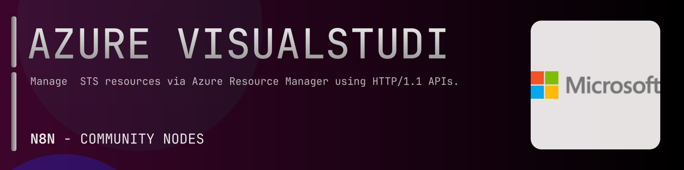

# @n8n-dev/n8n-nodes-azure-visualstudio-csm



[](https://www.npmjs.com/package/@n8n-dev/n8n-nodes-azure-visualstudio-csm)
[](https://opensource.org/licenses/MIT)

---

**Stop writing azure-visualstudio-csm API integrations by hand.**

Every time you connect n8n to azure-visualstudio-csm, you waste hours mapping endpoints, defining parameters, and debugging schemas. You copy-paste from docs, fix edge cases, and pray nothing breaks.

**What if connecting n8n to azure-visualstudio-csm took 5 minutes, not half a day?**

This node gives you **4+ resources** out of the box: **Operations**, **Accounts**, **Projects**, **Extensions**: with full CRUD operations, typed parameters, and zero manual configuration.

---

## What You Get

- **Zero boilerplate**: Resources, operations, and fields are pre-configured and ready to use
- **Full CRUD**: Create, read, update, and delete support where the API allows it
- **Typed parameters**: No more guessing field types
- **Built-in auth**: API key authentication, ready to go
- **Declarative**: Native n8n performance, no custom execute() overhead

---

## Install

```bash
npm install @n8n-dev/n8n-nodes-azure-visualstudio-csm
```

**Or in n8n:**
1. **Settings → Community Nodes → Install**
2. Search: `@n8n-dev/n8n-nodes-azure-visualstudio-csm`
3. Click **Install**

---

## Quick Start

1. Install the node (above)
2. Add credentials: **azure-visualstudio-csm API** → paste your API key
3. Drag the **azure-visualstudio-csm** node into your workflow
4. Pick a resource → pick an operation → done.

That's it. No configuration files. No code. It just works.

---

## Resources

<details>
<summary><b>Operations</b> (1 operations)</summary>

- Get Operations List

</details>

---

## Why This Node?

**Without this node:**
- Hours of manual API integration
- Copy-pasting from azure-visualstudio-csm docs
- Debugging auth, pagination, error handling
- Maintaining your own client code

**With this node:**
- Install → configure → use. 5 minutes.
- Auto-generated from the official azure-visualstudio-csm OpenAPI spec
- Always up to date when the API changes
- Native n8n performance

---

## Auto-Generated
This node was auto-generated from the official **azure-visualstudio-csm** OpenAPI specification using
[@n8n-dev/n8n-openapi-node-ultimate](https://github.com/kelvinzer0/n8n-openapi-node-ultimate),
then validated against the live API so you get accurate types and real parameters, not guesswork.

When the azure-visualstudio-csm API updates, this node updates too.

---


## License

MIT © [kelvinzer0](https://github.com/n8n-code)
